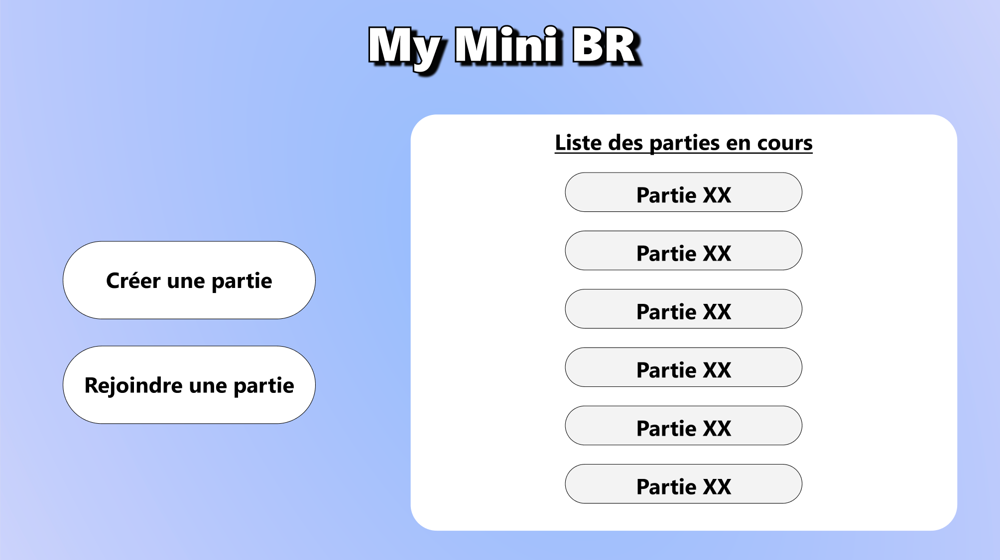
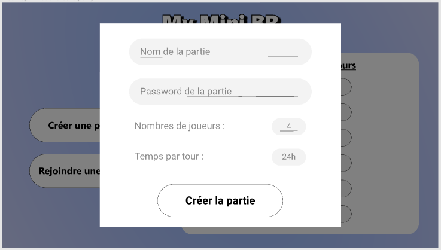
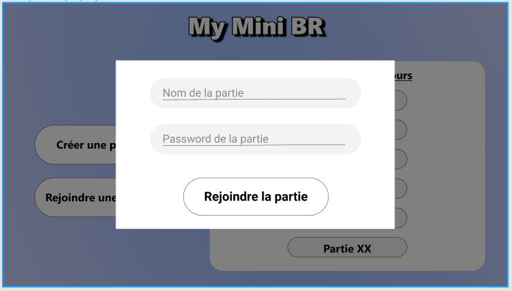
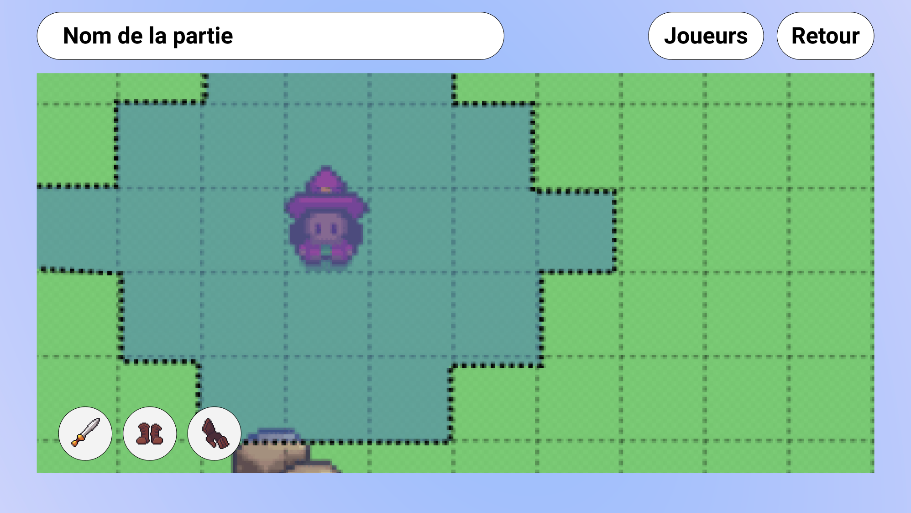
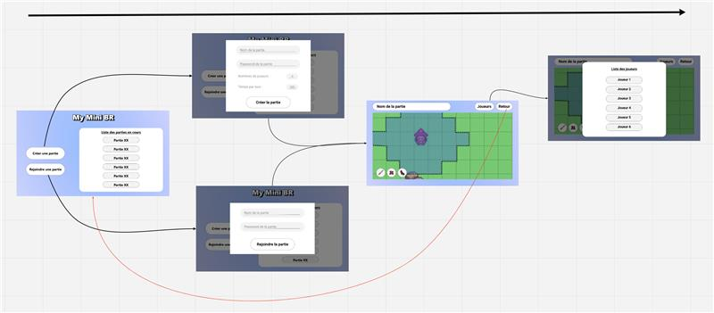
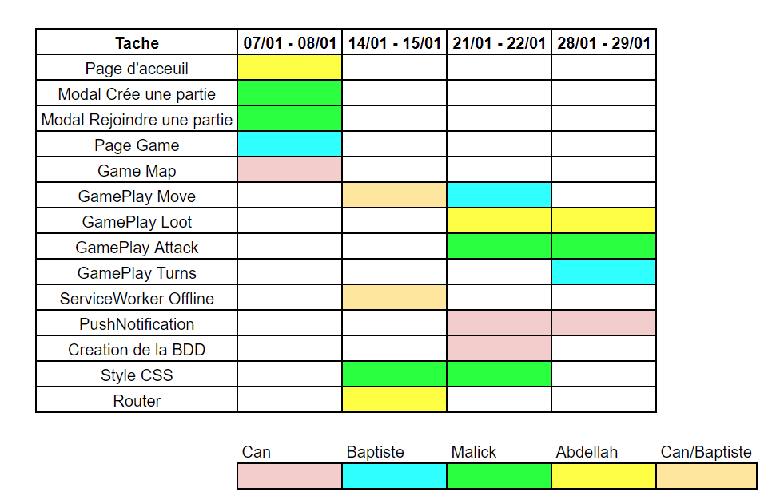

# Project Title

PWA-mini-BR is a small turn-based game playable with friends implements in a Progressive Web App.

## Project's Screenshots
### Index page

*(Screenshot of Figma's mockup)*
### Modals 

*(Screenshot of Figma's mockup)*

*(Screenshot of Figma's mockup)*
### Game page

*(Screenshot of Figma's mockup)*

## Navigation

## Schedule

## Getting Started
These instructions will get you a copy of the project up and running on your local machine for development and testing purposes. See deployment for notes on how to deploy the project on a live system.

## Prerequisites
You have to install node on your machine : https://nodejs.org/en/download/

## Installing
A step by step series of examples that tell you how to get a development env running.

Step 1: clone the project by using the commands below :
```
git clone https://github.com/Hyddrax/PWA-mini-BR.git
```
Step 2: go to mini-br's folder :
```
cd mini-br
```
Step 3: install the packages:
```
npm install package.json
```
Step 4: start your local server:
```
npm start
```

## Built With
- Framework front-end : Reactjs → https://fr.reactjs.org/
  - We all know the basics of React
- Framework back-end: Express → https://expressjs.com/fr/
  - Light and easy to implement
- Data base : MongoDB → https://docs.mongodb.com/
  - No need of relational database

## Cache strategy
Precaching :
If the network is available, you don't go through the cache. If it is unavailable, we use the versions of the cache.
* 👍 Always up to date with the server version,
* 👎 Slower, waiting for server comeback

## Technological locks
Service Worker : learn more with help of teachers and follow the classes.

Map : create and use a 2D map → use a 2D background image and add over the gameplay features
## Authors
- [Hyddrax](https://github.com/Hyddrax)
- [abdellahJR](https://github.com/abdellahJR)
- [baptistelechat](https://github.com/baptistelechat)
- [assimmht](https://github.com/assimmht)
