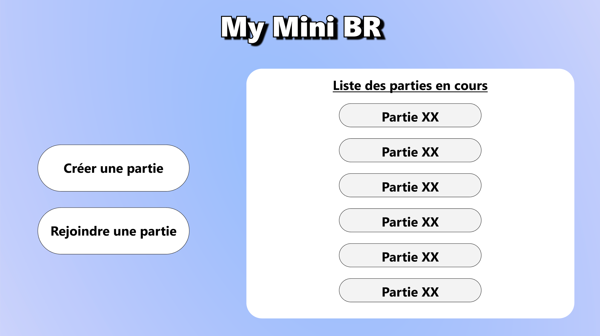
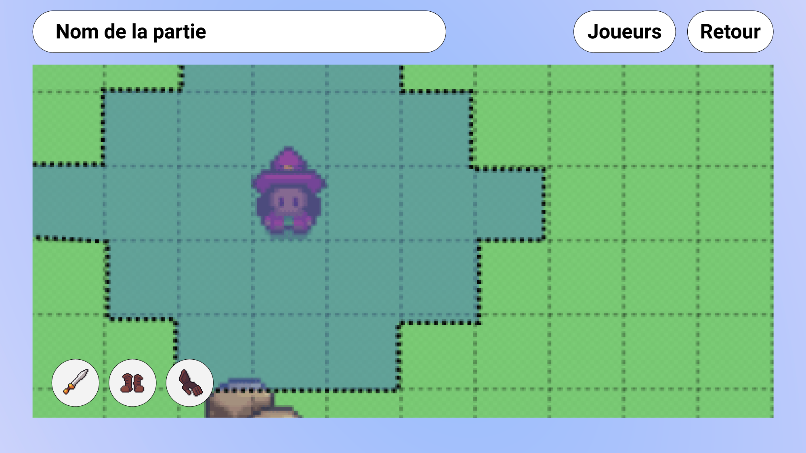

# Project Title

PWD-mini-BR is a small turn-based game playable with friends implements in a Progressive Web App.

#### Index page

#### Game page

## Getting Started
These instructions will get you a copy of the project up and running on your local machine for development and testing purposes. See deployment for notes on how to deploy the project on a live system.

## Prerequisites
You have to install node on your machine : https://nodejs.org/en/download/

## Installing
A step by step series of examples that tell you how to get a development env running.
Step 1: close the project by using the commands below:
### `git clone https://github.com/Hyddrax/PWA-mini-BR.git`
Step 2: go to mini-br :
### `cd mini-br`
Step 3: install the packages:
### `npm install package.json`
Step 4: start your local server:
### `npm start`

## Built With:
- Framework front-end : Reactjs --> https://fr.reactjs.org/
- Framework back-end: Expo --> https://docs.expo.io/
- Data base : MongoDB --> https://docs.mongodb.com/

## Authors
- [Hyddrax](https://github.com/Hyddrax)
- [abdellahJR](https://github.com/abdellahJR)
- [baptistelechat](https://github.com/baptistelechat)
- [assimmht](https://github.com/assimmht)
